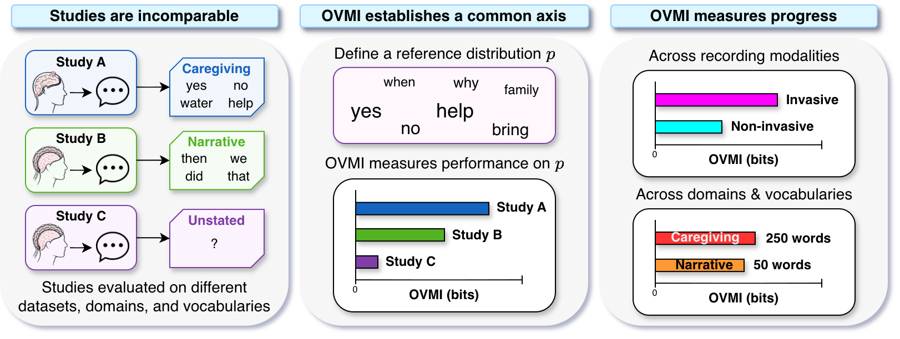

# OVMI

[](https://arxiv.org/abs/PLACEHOLDER)
[](LICENSE)

`ovmi` is a lightweight python package that computes **open-vocabulary mutual information (OVMI)**, a benchmarking metric for speech brain-computer interfaces (BCIs). OVMI is a simple measure of the mutual information between a user's intent and the output of a speech BCI under an assumed reference distribution. Most users should start with the library defaults.

**Paper:** ["On the Problem of Measuring Progress in Speech Brain-Computer Interfaces"](https://arxiv.org/abs/PLACEHOLDER) 



OVMI asks how many bits of information about the user's intended word does a speech BCI transmit? It combines two things that are misleading on their own:

- Coverage: how much probability mass the chosen vocabulary captures under a
  reference language distribution.
- Mutual information: how well the decoder distinguishes words inside its vocabulary.

This matters because evaluation data cover different distributions and a tiny vocabulary can be accurate but cover little of the relevant language a speech BCI should allow a user to say. OVMI scores a decoder directly against a reference distribution of desired speech, allowing many different methods tied to various evaluation data and modalities to be compared.

If you find this work helpful in your research, please cite the paper:
```bibtex
@article{jayalath2026ovmi,
  title={On the Problem of Measuring Progress in Speech Brain--Computer Interfaces},
  author={Jayalath, Dulhan and Ballyk, Benjamin and Parker Jones, Oiwi},
  journal={arXiv preprint arXiv:PLACEHOLDER},
  year={2026}
}
```

## Installation

Install directly from GitHub:

```bash
pip install git+https://github.com/neural-processing-lab/OVMI.git
```

## Quick Start

### Using OVMI
Pass a reference distribution (optional) and the vocabulary you want to evaluate. The
reference can contain counts or probabilities; it is normalised internally.
The scalar `accuracy` should be the macro accuracy, i.e. the average of the
individual-word correct-decoding probabilities for the evaluated vocabulary.

```python
from ovmi import ovmi

reference = {
    "yes": 120,
    "no": 80,
    "pain": 30,
    "water": 20,
    "music": 10,
}

vocabulary = ["yes", "no", "water"]

macro_accuracy = (0.70 + 0.65 + 0.55) / 3

score = ovmi(reference, vocabulary, accuracy=macro_accuracy)
print(score)
```

### Replicating the Paper
Follow the notebook at `experiments/ovmi_paper.ipynb`

## Default Reference

The reference distribution says how often each word is expected to be intended
by the user in the setting you care about.
Choose a reference that matches the use case. For a general English benchmark,
a broad corpus frequency norm is a reasonable default. For a communication aid,
clinical task, experiment, or domain-specific interface, use word counts from
that actual setting when you have them. The values can be raw counts or
probabilities; `ovmi` normalises them internally.

If no reference distribution is provided, `ovmi` downloads and caches the
SUBTLEX-UK frequency norm from OSF, then uses its `Spelling` and `FreqCount`
columns:

```python
score = ovmi(["yes", "no", "water"], accuracy=0.47)
```

You can also load the default reference directly:

```python
from ovmi import load_subtlex_uk

reference = load_subtlex_uk()
```

## Advanced Modes

The default scalar approximation is usually the right starting point. `ovmi`
also supports two more detailed calculation modes when you have richer
measurements.

## Per-Word Accuracies

Pass an accuracy mapping when each intended word has its own correct-decoding
probability. Each row distributes its remaining error mass uniformly over the
other words in the selected vocabulary:

```python
accuracies = {
    "yes": 0.70,
    "no": 0.65,
    "water": 0.55,
}

score = ovmi(reference, vocabulary, accuracy=accuracies)
```

## Full Confusion Matrix

For full OVMI from an empirical confusion matrix, pass a NumPy array whose rows
are intended words and columns are predicted words. Matrix entries may be counts
or probabilities; rows are normalised internally.

```python
import numpy as np
from ovmi import ovmi, full_ovmi

labels = ["yes", "no", "water"]
confusion = np.array([
    [18, 1, 1],
    [2, 15, 3],
    [1, 4, 10],
])

score = ovmi(
    reference,
    vocabulary,
    method="full",
    confusion_matrix=confusion,
    labels=labels,
)

same_score = full_ovmi(reference, labels, confusion_matrix=confusion, labels=labels)
```

## Detailed Output

Set `return_details=True` to get the component terms alongside the OVMI score:

```python
details = ovmi(reference, vocabulary, accuracy=0.47, return_details=True)

print(details.score)
print(details.coverage)
print(details.in_vocab_information)
print(details.output_entropy)
print(details.conditional_entropy)
```
